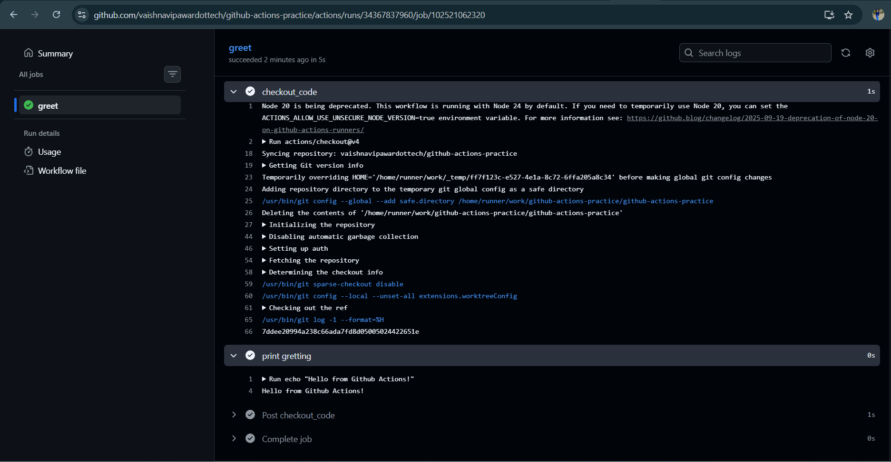
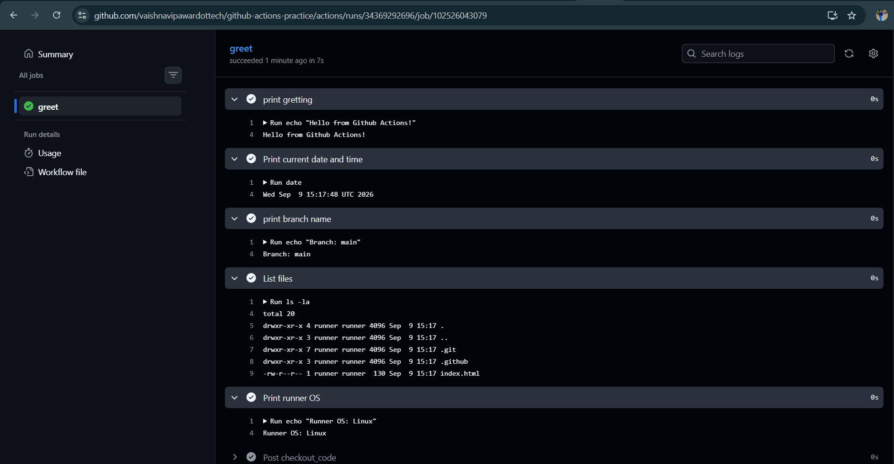

# Day 40 – Your First GitHub Actions Workflow

##  Goal

Today I created my first **GitHub Actions workflow** and ran a CI pipeline in the cloud.

This helped me understand how GitHub Actions works in practice instead of only learning CI/CD concepts theoretically.

---

##  Task 1: Set Up

Created a public GitHub repository:

`github-actions-practice`

Repository structure:

```text
github-actions-practice/
└── .github/
    └── workflows/
        └── hello.yml
```

The `.github/workflows/` directory is where GitHub Actions workflow files are stored.

---

## ⚙️ Task 2: Hello Workflow

Created `.github/workflows/hello.yml`:

```yaml
name: Hello GitHub Actions

on:
  push:

jobs:
  greet:
    runs-on: ubuntu-latest

    steps:
      - name: Checkout code
        uses: actions/checkout@v4

      - name: Print greeting
        run: echo "Hello from GitHub Actions!"
```

### What happened?

Every time I pushed code to GitHub:

```text
Push Code
    ↓
GitHub Actions Triggered
    ↓
greet Job
    ↓
Ubuntu Runner
    ↓
Checkout Code
    ↓
Print Hello from GitHub Actions!
```

The workflow successfully completed with a **green status**.

---

##  Task 3: Understand the Anatomy

### `on:`

Defines **when the workflow should run**.

In this workflow:

```yaml
on:
  push:
```

The workflow runs whenever code is pushed to the repository.

---

### `jobs:`

Defines the jobs that GitHub Actions needs to execute.

```yaml
jobs:
  greet:
```

Here, `greet` is the name of our job.

---

### `runs-on:`

Specifies the operating system/environment where the job will run.

```yaml
runs-on: ubuntu-latest
```

The job runs on a GitHub-hosted Ubuntu runner.

---

### `steps:`

Contains the individual tasks executed inside a job.

```yaml
steps:
  - name: Checkout code
    uses: actions/checkout@v4

  - name: Print greeting
    run: echo "Hello from GitHub Actions!"
```

---

### `uses:`

Uses an existing GitHub Action instead of writing the complete logic ourselves.

```yaml
uses: actions/checkout@v4
```

`actions/checkout` checks out the repository code onto the runner.

---

### `run:`

Executes a shell command on the runner.

```yaml
run: echo "Hello from GitHub Actions!"
```

---

### `name:`

Provides a readable name for the workflow or a step.

Example:

```yaml
- name: Print greeting
```

This name is displayed in the GitHub Actions interface.

---

## ➕ Task 4: Add More Steps

Updated `hello.yml` to print additional information:

```yaml
name: Hello GitHub Actions

on:
  push:

jobs:
  greet:
    runs-on: ubuntu-latest

    steps:
      - name: Checkout code
        uses: actions/checkout@v4

      - name: Print greeting
        run: echo "Hello from GitHub Actions!"

      - name: Print current date and time
        run: date

      - name: Print branch name
        run: echo "Branch: ${{ github.ref_name }}"

      - name: List files
        run: ls -la

      - name: Print runner OS
        run: echo "Operating System: ${{ runner.os }}"
```

### What I observed

The workflow now:

1. Checks out the repository
2. Prints a greeting
3. Prints the current date and time
4. Prints the branch that triggered the workflow
5. Lists the files in the repository
6. Prints the runner's operating system

A new workflow run was automatically triggered after pushing the changes.

---

##  Task 5: Break It On Purpose

To understand pipeline failures, I intentionally added a step that fails:

```yaml
- name: Intentional failure
  run: exit 1
```

After pushing the change, the GitHub Actions workflow failed and showed a **red ❌ status**.

### How I read the error

I opened the failed workflow run from the **Actions** tab and then opened the failed job.

GitHub Actions showed:

* The step where the failure occurred
* The command that was executed
* The error/output generated by the command
* The final job status

After identifying the failing step, I removed the intentional failure and pushed the fix.

The workflow then ran successfully again with a **green ✅ status**.

---

## 📸 Successful Pipeline Run

Screenshot of the successful GitHub Actions workflow:





---

## 🔄 Complete Workflow Flow

```text
Developer
    │
    │ git push
    ▼
GitHub Repository
    │
    │ push trigger
    ▼
GitHub Actions
    │
    ▼
greet Job
    │
    ▼
Ubuntu Runner
    │
    ├── Checkout Code
    ├── Print Greeting
    ├── Print Date & Time
    ├── Print Branch
    ├── List Files
    └── Print Runner OS
    │
    ▼
Successful Run ✅
```

---

## 🧠 What I Learned

* GitHub Actions workflows are stored inside `.github/workflows/`.
* A workflow can be triggered automatically by events such as `push`.
* A job runs on a specified runner using `runs-on`.
* `steps` define the individual tasks executed by a job.
* `uses` allows us to use existing GitHub Actions.
* `run` executes shell commands on the runner.
* A failed pipeline is useful because it shows exactly where something went wrong.
* CI/CD becomes much clearer when you actually create, run, break, fix, and observe a pipeline.


---

## 🚀 Key Takeaway

Today CI/CD stopped being just a concept.

I created my **first GitHub Actions workflow**, watched it execute on a cloud-hosted runner, intentionally broke it, investigated the failure, fixed it, and got the pipeline green again.
