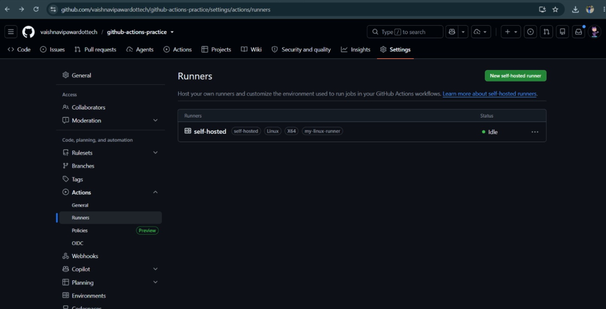
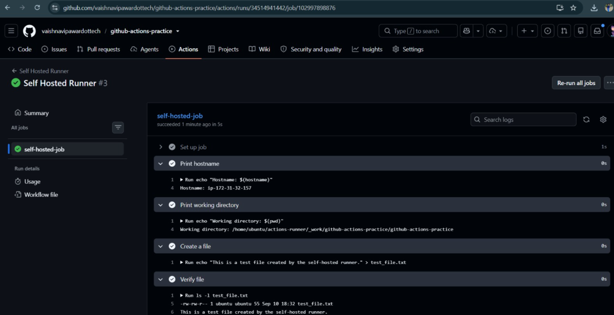

# Day 42 – Runners: GitHub-Hosted & Self-Hosted

## Overview

Today I learned about **GitHub Actions runners** — the machines where GitHub Actions jobs actually execute.

I explored:

- GitHub-hosted runners
- Self-hosted runners
- Pre-installed tools
- Runner labels
- Running workflows on my own machine/VM
- GitHub-hosted vs self-hosted runners

---

## Task 1: GitHub-Hosted Runners

A **GitHub-hosted runner** is a virtual machine provided and managed by GitHub to execute GitHub Actions workflows.

GitHub provides different operating system environments such as:

- `ubuntu-latest`
- `windows-latest`
- `macos-latest`

### Workflow

I created a workflow with three jobs, each running on a different operating system.

Each job prints:

- OS name
- Runner hostname
- Current user

    name: GitHub Hosted Runners

    on:
      workflow_dispatch:

    jobs:
      ubuntu:
        runs-on: ubuntu-latest
        steps:
          - name: Show Ubuntu runner information
            run: |
              echo "OS: Ubuntu"
              echo "Hostname: $(hostname)"
              echo "User: $(whoami)"

      windows:
        runs-on: windows-latest
        steps:
          - name: Show Windows runner information
            shell: powershell
            run: |
              Write-Host "OS: Windows"
              Write-Host "Hostname: $env:COMPUTERNAME"
              Write-Host "User: $env:USERNAME"

      macos:
        runs-on: macos-latest
        steps:
          - name: Show macOS runner information
            run: |
              echo "OS: macOS"
              echo "Hostname: $(hostname)"
              echo "User: $(whoami)"

### Observation

The three jobs can run independently and in parallel because each job gets its own runner environment.

### What is a GitHub-hosted runner?

A GitHub-hosted runner is a machine provided and managed by **GitHub** that executes GitHub Actions jobs.

GitHub manages the underlying runner infrastructure and provides different operating system environments for workflows.

---

## Task 2: Explore What's Pre-installed

GitHub-hosted runners come with many commonly used development and DevOps tools pre-installed.

On the `ubuntu-latest` runner, I checked:

- Docker
- Python
- Node.js
- Git

### Workflow

    name: Runner Tools

    on:
      workflow_dispatch:

    jobs:
      tools:
        runs-on: ubuntu-latest

        steps:
          - name: Check installed tools
            run: |
              echo "Docker version:"
              docker --version

              echo "Python version:"
              python3 --version

              echo "Node version:"
              node --version

              echo "Git version:"
              git --version

### Why do pre-installed tools matter?

Pre-installed tools make workflows easier and faster to configure.

Instead of installing common tools every time a workflow runs, they can be used directly in the workflow.

This helps to:

- Reduce workflow execution time
- Simplify workflow configuration
- Avoid unnecessary installation steps
- Quickly start CI/CD jobs

GitHub also provides documentation containing the complete list of software available on GitHub-hosted runners.

---

## Task 3: Set Up a Self-Hosted Runner

A **self-hosted runner** is a machine that I configure and manage myself to execute GitHub Actions workflows.

I configured a Linux self-hosted runner on my own Linux machine/VM.

### Setup Process

I went to:

**GitHub Repository → Settings → Actions → Runners → New self-hosted runner**

Then selected:

- Linux
- x64

GitHub generated the setup commands required to:

1. Download the runner
2. Extract the runner
3. Configure the runner
4. Connect it to the repository
5. Start the runner

The runner can be started using:

    ./run.sh

After starting the runner, I verified it in GitHub.

### Runner Status

The runner appeared in GitHub with:

**🟢 Idle**

This indicates that the runner is online and ready to accept a job.

### Screenshot

---

## Task 4: Use the Self-Hosted Runner

I created:

`.github/workflows/self-hosted.yml`

The workflow uses:

    runs-on: self-hosted

### Workflow

    name: Self Hosted Runner

    on:
      workflow_dispatch:

    jobs:
      self-hosted-job:
        runs-on: self-hosted

        steps:
          - name: Print hostname
            run: |
              echo "Hostname: $(hostname)"

          - name: Print working directory
            run: |
              echo "Working Directory:"
              pwd

          - name: Create file
            run: |
              echo "Created by GitHub Actions self-hosted runner" > day-42-test.txt

          - name: Verify file
            run: |
              ls -l day-42-test.txt
              cat day-42-test.txt

### Observation

The workflow executed on my own self-hosted machine instead of a GitHub-hosted runner.

The hostname printed by the workflow matched my self-hosted machine/VM.

The workflow also created:

`day-42-test.txt`

I verified that the file existed on my machine after the workflow completed.

### Screenshot

### Important Observation

With a self-hosted runner, the workflow runs directly on infrastructure that I manage.

Therefore, files and other changes made by workflows can remain on the machine unless they are explicitly removed.

---

## Task 5: Labels

Labels help GitHub identify and select specific runners.

I added the custom label:

    my-linux-runner

Then updated the workflow to use:

    runs-on: [self-hosted, my-linux-runner]

### Workflow

    name: Self Hosted Runner With Label

    on:
      workflow_dispatch:

    jobs:
      labeled-runner:
        runs-on: [self-hosted, my-linux-runner]

        steps:
          - name: Show runner information
            run: |
              echo "Running on:"
              hostname

              echo "Working directory:"
              pwd

### Why are labels useful?

Labels are useful when multiple self-hosted runners are available.

For example, different runners might have different capabilities:

    Runner 1 → Linux + Docker
    Runner 2 → Linux + Node.js
    Runner 3 → Windows + .NET

A workflow can use labels to target a runner with the required environment.

For example:

    runs-on: [self-hosted, linux, docker]

This means GitHub looks for a self-hosted runner that has all the specified labels.

---

## Task 6: GitHub-Hosted vs Self-Hosted

| **Feature** | **GitHub-Hosted** | **Self-Hosted** |
|---|---|---|
| Who manages it? | GitHub | User/Organization |
| Cost | Uses GitHub-hosted runner usage included in the plan or billed based on usage | User manages the infrastructure cost |
| Pre-installed tools | Many common tools are pre-installed | User decides what to install |
| Good for | General CI/CD workflows and quick setup | Custom environments, private infrastructure and specialized requirements |
| Security concern | Less control over the underlying machine | User is responsible for security, updates and maintenance |

### GitHub-Hosted Runners

Advantages:

- Easy to configure
- No server maintenance
- Many tools are already installed
- Suitable for general CI/CD workflows
- Supports multiple operating systems

### Self-Hosted Runners

Advantages:

- Full control over the machine
- Custom software and dependencies can be installed
- Can access private/internal infrastructure
- Useful for specialized environments
- Can use custom hardware

Disadvantages:

- Requires maintenance
- Requires security management
- Requires updates and dependency management
- Persistent files and environment changes need to be handled carefully

---

## GitHub-Hosted vs Self-Hosted: Architecture

### GitHub-Hosted Runner

    GitHub
       │
       ├── Provides runner
       │
       └── Executes GitHub Actions job
                 │
                 └── Managed by GitHub

### Self-Hosted Runner

    My Machine / Cloud VM
              │
              ├── Self-hosted runner
              │
              └── Executes GitHub Actions job
                        │
                        └── Managed by me

---

## Runner Labels

Labels allow workflows to select runners based on their capabilities.

For example:

    runs-on: [self-hosted, linux, docker]

The runner must have all of these labels:

    self-hosted
    linux
    docker

This is useful when an organization has multiple self-hosted runners with different operating systems, tools or hardware.

---

## GitHub-Hosted Runner vs Self-Hosted Runner: Key Difference

The main difference is **who manages the machine**.

### GitHub-Hosted

- GitHub provides the runner
- GitHub manages the infrastructure
- Common tools are already available
- Less maintenance is required from the user

### Self-Hosted

- User or organization provides the machine
- User manages the infrastructure
- User decides which tools are installed
- User is responsible for maintenance and security

---

## Key Takeaways

- A **runner** is the machine that executes a GitHub Actions job.
- GitHub-hosted runners are managed by **GitHub**.
- GitHub provides runners for Linux, Windows and macOS.
- GitHub-hosted runners come with many commonly used tools pre-installed.
- A **self-hosted runner** is a machine configured and managed by the user or organization.
- `runs-on: self-hosted` sends a job to a self-hosted runner.
- Runner labels help target specific self-hosted runners.
- Multiple jobs can run in parallel when suitable runners are available.
- Self-hosted runners provide more control over the environment.
- Self-hosted runners also require the user to manage security, maintenance and updates.
- Understanding runners is important because the runner environment directly affects how GitHub Actions workflows execute.

## Documentation

GitHub-hosted runners:

https://docs.github.com/en/actions/using-github-hosted-runners/about-github-hosted-runners

Self-hosted runners:

https://docs.github.com/en/actions/hosting-your-own-runners/about-self-hosted-runners

---

## Conclusion

Day 42 helped me understand where GitHub Actions workflows actually run.

I worked with GitHub-hosted runners across different operating systems and configured a self-hosted Linux runner to execute workflows on my own machine.

This gave me practical experience with **runner environments, pre-installed tools, self-hosted infrastructure and runner labels** in GitHub Actions.